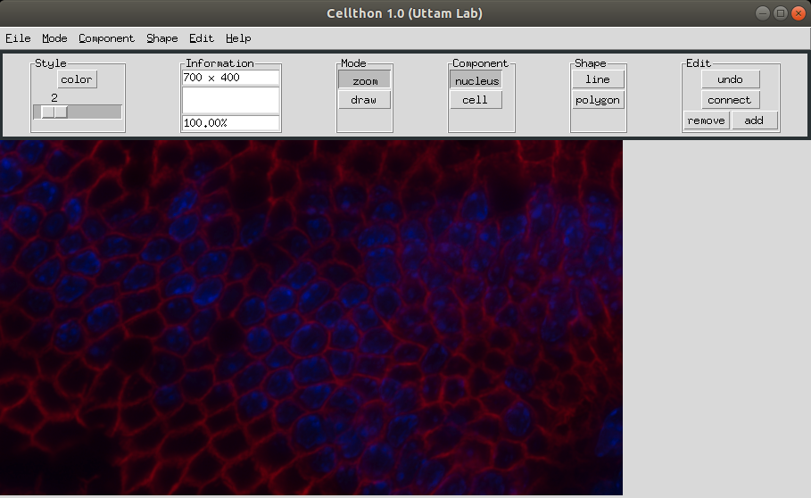

# Cellthon for Annotation of Nuclei and Cells in Tissue Images

A Python based graphical user interface (GUI) for annotating cells and their nuclei in tissue images that was developed using Tkinter toolkit.

Cellthon is available for use on computers running both Linux and Windows operating systems. To download Cellthon one can use this [link](https://drive.google.com/drive/folders/17shzTjL1k8ijDkJE2-bZxgQPuZI2Hv5n?usp=sharing).

To run Cellthon on Linux, follow these steps:
* Copy the cellthon file to some folder on your computer
* Open the terminal and go to that folder. For example :~$ cd Path/to/folder/with/GUI
* Run the cellthon file using the command like this :~/Path/to/folder/with/GUI$ ./cellthon
* Enjoy annotation!

To run Cellthon on Windows, follow these steps:
* Copy the cellthon.exe to some folder on your computer
* Double click on cellthon.exe runs the GUI
* Enjoy annotation!

Cellpose was used by expert pathologists to annotate nuclei and cells in 75 tiff images of tissue sections from eight organs of the human gastrointestinal system. This dataset was used to develop and test a new [unsupervised algorithm](https://www.biorxiv.org/) for automatic segmentation of nuclei and cells in images of complex tissues.
